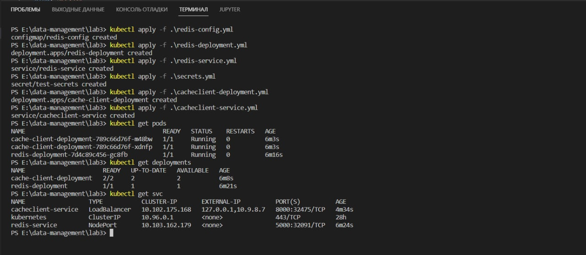
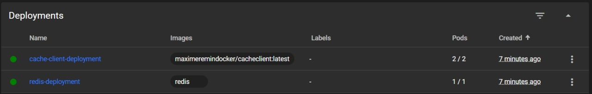
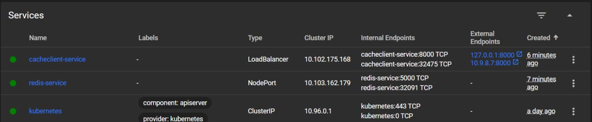
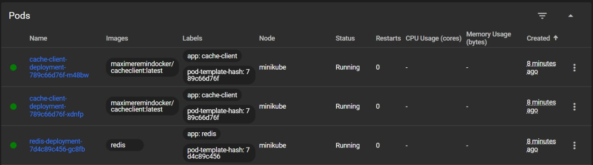
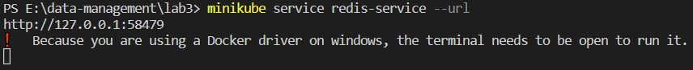
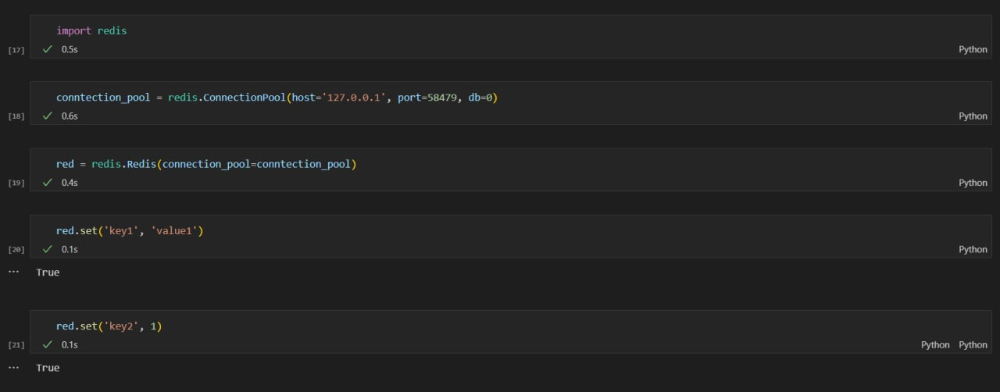
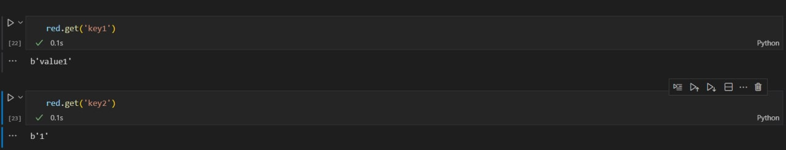

# Лабораторная работа №3
> Жерлыгин М.А.

## Деплой redis и cacheclient на кластер миникуба

Загружаем ресурсы на кластер миникуба с помощью `kubectl apply -f <путь до yaml файла>`, далее проверяем, что ресурсы создались с помощью комманд `kubectl get <вид ресурса>`. Данная команда выведет нам все доступные ресурсы в неймспейсе `default` (если нужны ресурсы из другого неймспейса, необходимо добавить `-n <namespace>`).

Так же можно удостовериться в наличии созданных ресурсов в dashboard (запустить dashboard миникуба можно с помощью `minikube dashboard`).

## Доступ к развернутым ресурсам

> К сожалению, запросы к cacheclient почему-то не работали, поэтому я изменил тип сервиса redis-serivce на NodePort для доступа к нему из вне, и заэкспоузил с помощью `minikube service <название сервиса> --url`. На что мы получаем url сервиса.

И, в конечном итоге, с помощью библиотеки `radis` добавляем и просматриваем сущность по ключу. Для подключения используем хост и порт из полученного url на прошлом шаге.

